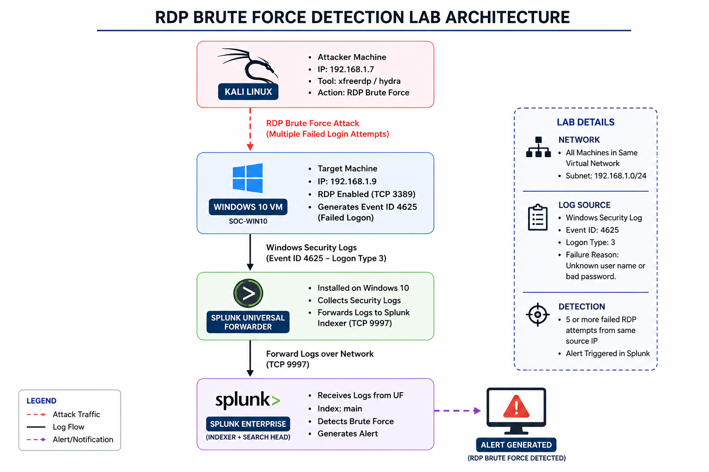
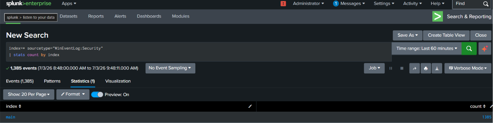
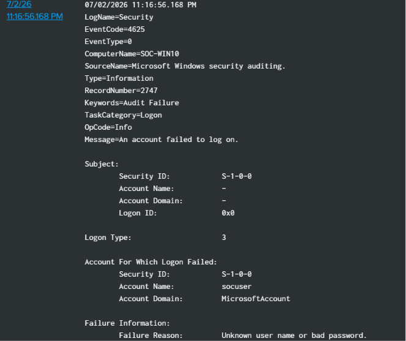
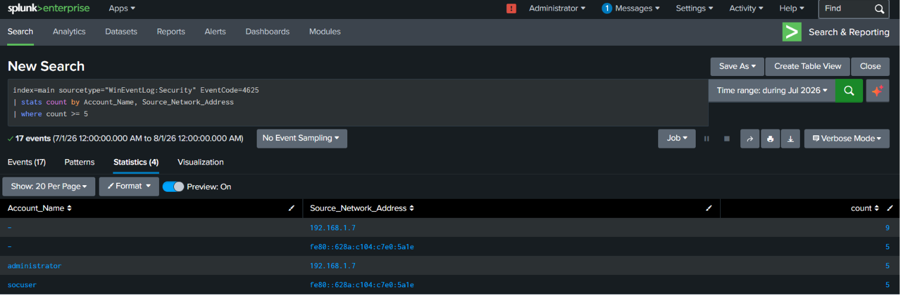
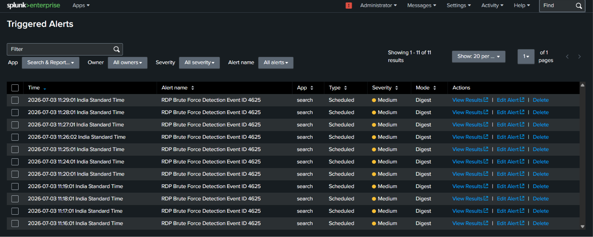
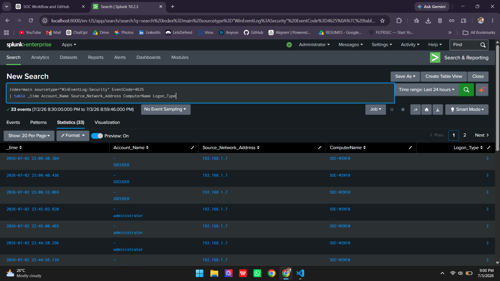
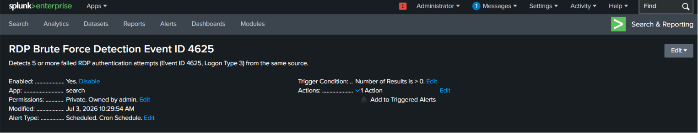
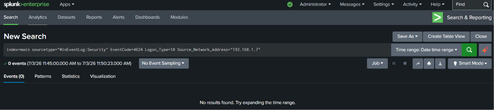
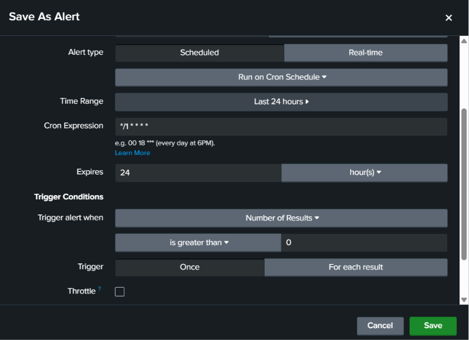

# 🛡️ Project 01 - RDP Brute Force Detection and Investigation using Splunk

## Project Overview

This project demonstrates the complete detection and investigation of an RDP brute-force attack in a SOC home lab. A simulated attack was launched from a Kali Linux attacker machine against a Windows 10 virtual machine. Windows Security logs were forwarded to Splunk Enterprise using the Splunk Universal Forwarder, where a custom detection rule identified multiple failed authentication attempts and generated an alert.

The alert was investigated by analyzing Windows Security Event ID 4625, validating the attack source, identifying the targeted host and user account, confirming that no successful RDP authentication occurred, and documenting the complete incident response process.

## 🏗️ Lab Architecture

The following diagram illustrates the SOC home lab used to simulate, detect, and investigate an RDP brute-force attack.

## 🎯 Attack Scenario

A simulated RDP brute-force attack was launched from a Kali Linux attacker machine (192.168.1.7) targeting the Windows 10 victim machine (SOC-WIN10 - 192.168.1.9).

The objective of the simulation was to:

- Generate multiple failed RDP authentication attempts.
- Detect the activity using a custom Splunk detection rule.
- Investigate the generated alert using Windows Security logs.
- Validate whether the attack resulted in successful authentication.

## 📸 Investigation Evidence

The following screenshots document the complete investigation workflow, from log collection to alert validation.

### 1. Log Collection

Windows Security logs were successfully ingested into Splunk Enterprise through the Splunk Universal Forwarder.

---

### 2. Windows Security Event ID 4625

The failed RDP authentication attempts generated Windows Security Event ID 4625.

---

### 3. Detection Query

A custom Splunk SPL query identified multiple failed authentication attempts from the same source.

---

### 4. Splunk Alert Configuration

A scheduled Splunk alert was configured to detect five or more failed RDP authentication attempts within a five-minute window.

---

### 5. Triggered Alert

The configured detection rule successfully generated a Splunk alert after the attack simulation.

---

### 6. Investigation Query

The investigation identified the source IP address, target host, target user account, and logon type associated with the failed authentication attempts.

---

### 7. Alert Summary

The alert details were reviewed to validate the detection configuration and confirm the alert execution.

---

### 8. Verification of Successful Login

A search for successful RDP logon events (Event ID 4624, Logon Type 10) confirmed that no successful authentication occurred after the brute-force attempts.

---

### 9. Alert Throttle Configuration

Alert throttling was configured to prevent duplicate alerts from being generated for the same attack within the defined suppression period.

## 📚 Lessons Learned

During this project, I gained practical experience in:

- Building a custom Splunk detection rule for RDP brute-force attacks.
- Investigating Windows Security Event ID 4625.
- Identifying the source IP, target host, and target user during an investigation.
- Differentiating between True Positive, False Positive, and Benign Positive alerts.
- Verifying the absence of successful RDP authentication using Event ID 4624.
- Mapping the attack to the MITRE ATT&CK framework.
- Documenting the complete SOC investigation process using a structured workflow.

## 🛠️ Skills Demonstrated

- Splunk Enterprise
- SPL Query Development
- Windows Event Log Analysis
- Event ID 4625 Investigation
- RDP Brute Force Detection
- Alert Engineering
- Incident Investigation
- Incident Reporting
- MITRE ATT&CK Mapping
- Timeline Analysis
- SOC Documentation
