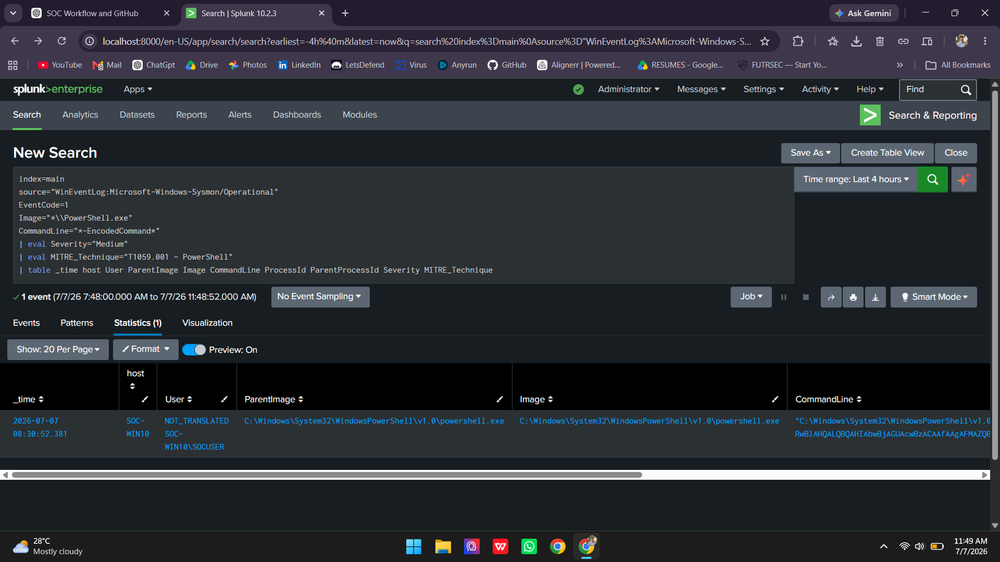
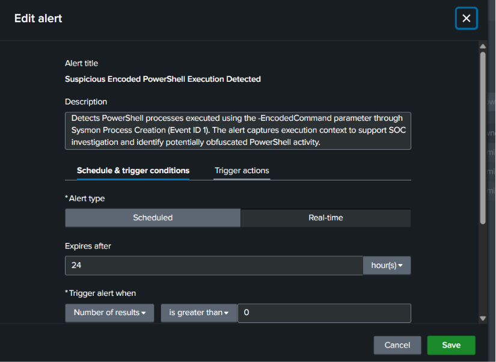
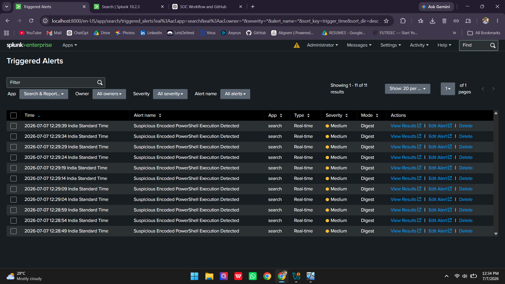
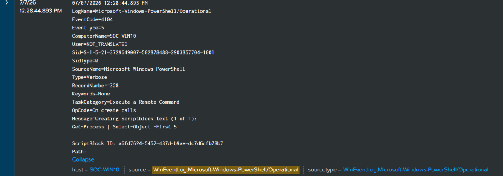
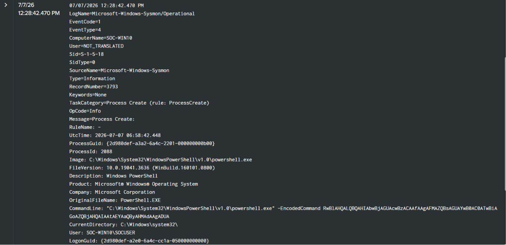
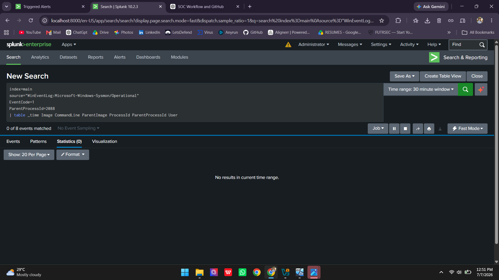
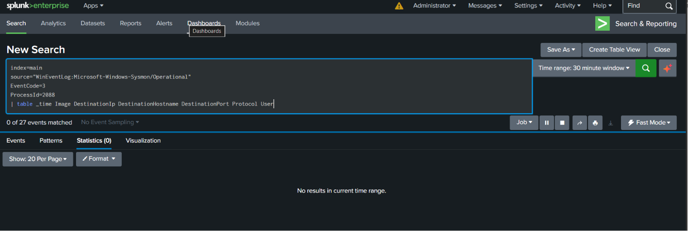
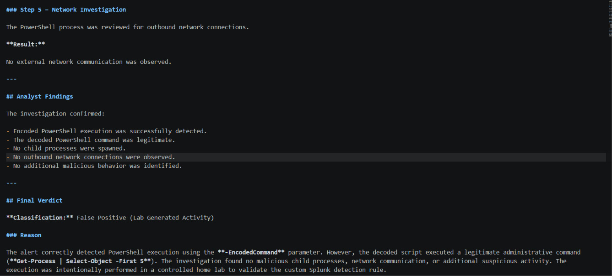

# Project 02 - Encoded PowerShell Detection and Investigation using Splunk & Sysmon

> **Hands-on SOC project demonstrating detection engineering, alert triage, log correlation, and incident investigation using Splunk Enterprise and Microsoft Sysmon.**

---

# Overview

This project demonstrates the complete Security Operations Center (SOC) workflow for detecting and investigating PowerShell execution using the **-EncodedCommand** parameter.

A custom Splunk detection rule was developed to identify encoded PowerShell activity, generate a real-time security alert, and support incident investigation using Microsoft Sysmon Process Creation (Event ID 1) and PowerShell Script Block Logging (Event ID 4104).

The investigation followed a structured SOC methodology, including alert validation, evidence collection, log correlation, and incident analysis to determine whether the activity represented malicious behavior or legitimate administrative activity. Based on the collected evidence, the alert was classified as a **False Positive (Lab Generated Activity).**

---

# Objectives

- Detect PowerShell execution using the **-EncodedCommand** parameter.
- Develop a custom Splunk detection rule.
- Configure a real-time Splunk alert.
- Generate PowerShell telemetry in a controlled SOC home lab.
- Investigate the triggered alert using Sysmon and PowerShell logs.
- Correlate evidence from multiple log sources.
- Classify the incident based on collected evidence.
- Document the investigation following SOC analyst methodology.

---

# Lab Environment

| Component | Technology |
|-----------|------------|
| SIEM | Splunk Enterprise |
| Log Forwarder | Splunk Universal Forwarder |
| Endpoint Monitoring | Microsoft Sysmon |
| Operating System | Windows 10 |
| Logging | PowerShell Script Block Logging (Event ID 4104) |
| Sysmon Configuration | SwiftOnSecurity Sysmon Config |

---

# Lab Architecture

```text
                 Encoded PowerShell Execution
                         (Lab Activity)
                               │
                               ▼
                    Windows 10 Endpoint
                               │
      Process Creation (Event ID 1) & Script Block Logging (4104)
                               │
                               ▼
                     Microsoft Sysmon
                               │
                               ▼
               Splunk Universal Forwarder
                               │
                               ▼
                  Splunk Enterprise SIEM
                               │
                    Custom Detection Rule
                               │
                               ▼
                   Real-Time Security Alert
                               │
                               ▼
                     SOC Investigation
                               │
                               ▼
          False Positive (Lab Generated Activity)
```

---

# Project Workflow

1. Configure Microsoft Sysmon.
2. Enable PowerShell Script Block Logging.
3. Configure Splunk Universal Forwarder.
4. Develop the custom Splunk detection rule.
5. Create a real-time Splunk alert.
6. Execute an encoded PowerShell command.
7. Validate the triggered alert.
8. Investigate Sysmon and PowerShell logs.
9. Correlate investigation evidence.
10. Classify the incident and document findings.

---

# Detection Logic

The detection rule monitors **Microsoft Sysmon Process Creation (Event ID 1)** to identify PowerShell executed with the **-EncodedCommand** parameter.

Encoded PowerShell commands are commonly used to obfuscate scripts and hide their contents. For this reason, any execution using this parameter should be investigated to determine whether the activity is legitimate or malicious.

---

# Investigation Methodology

The alert investigation followed this workflow:

1. Validate the triggered alert.
2. Review Sysmon Process Creation (Event ID 1).
3. Analyze PowerShell Script Block Logging (Event ID 4104).
4. Investigate child process activity.
5. Review outbound network connections.
6. Correlate evidence from multiple log sources.
7. Determine the final incident classification.

---

# Repository Structure

```text
Project-02-Encoded-PowerShell-Detection
│
├── Detection
│   ├── Detection-Rule.md
│   └── Splunk-Alert-Configuration.md
│
├── Investigation
│   └── Investigation-Report.md
│
├── Queries
│   └── Splunk-Queries.md
│
├── Screenshots
│
├── README.md
└── SUMMARY.md
```

---

# Skills Demonstrated

- Splunk Enterprise SIEM
- Detection Engineering
- SIEM Alert Creation
- Windows Event Log Analysis
- Microsoft Sysmon
- PowerShell Script Block Logging
- Alert Validation
- Alert Triage
- Incident Investigation
- Log Correlation
- Evidence Collection
- Evidence-Based Incident Analysis
- False Positive Analysis
- MITRE ATT&CK Mapping
- Technical Documentation

---

# MITRE ATT&CK Mapping

| Technique | ID |
|-----------|----|
| Command and Scripting Interpreter: PowerShell | T1059.001 |

---

## Key Investigation Evidence

### 1. Detection Rule



The custom SPL query detects PowerShell execution using the **-EncodedCommand** parameter.

---

### 2. Alert Configuration



A real-time Splunk alert was configured to trigger whenever the detection rule returned results.

---

### 3. Triggered Alert



The encoded PowerShell command successfully triggered the Splunk alert.

---

### 4. PowerShell Script Block Logging (Event ID 4104)



PowerShell Script Block Logging revealed the decoded PowerShell command executed during the investigation.

---

### 5. Sysmon Process Creation (Event ID 1)



Sysmon captured the encoded PowerShell process execution and related process details.

---

### 6. Child Process Investigation



No suspicious child processes were observed.

---

### 7. Network Investigation



No outbound network connections were identified.

---

### 8. Final Verdict



Based on the collected evidence, the activity was classified as a **False Positive (Lab Generated Activity).**
---

# Final Outcome

The custom detection successfully identified encoded PowerShell execution within the SOC home lab.

The investigation confirmed that the decoded PowerShell command executed a legitimate administrative task. No malicious child processes, outbound network connections, persistence mechanisms, or additional indicators of compromise were identified.

Based on the collected evidence, the incident was classified as a **Benign Positive (Authorized Lab Activity).**

---

# Key Takeaways

- Developed a custom Splunk detection rule for encoded PowerShell execution.
- Validated the detection using controlled lab activity.
- Investigated alerts using Microsoft Sysmon and PowerShell Script Block Logging.
- Correlated multiple log sources to support evidence-based decision making.
- Applied the complete SOC investigation workflow from alert validation through incident classification.
- Strengthened practical skills in Splunk, Windows event analysis, detection engineering, and incident response.
