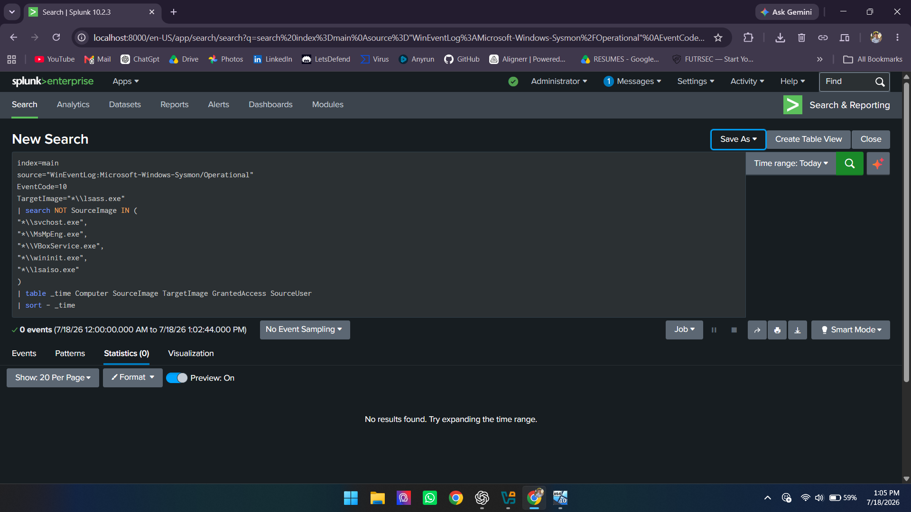
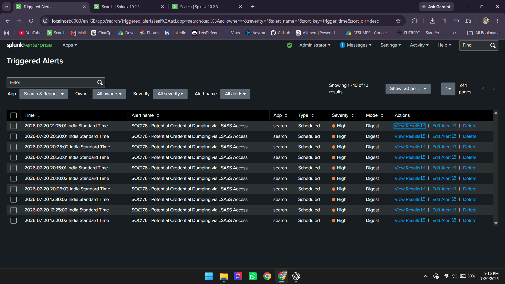
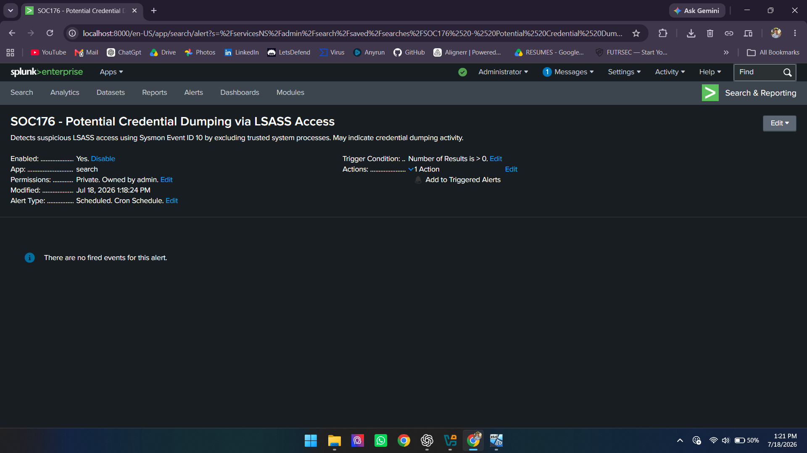
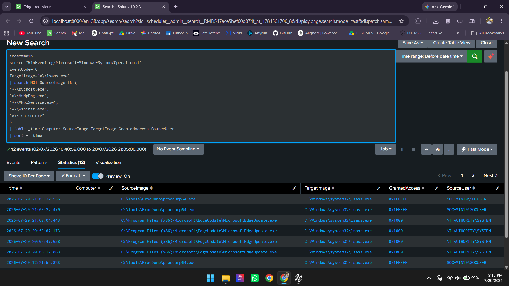
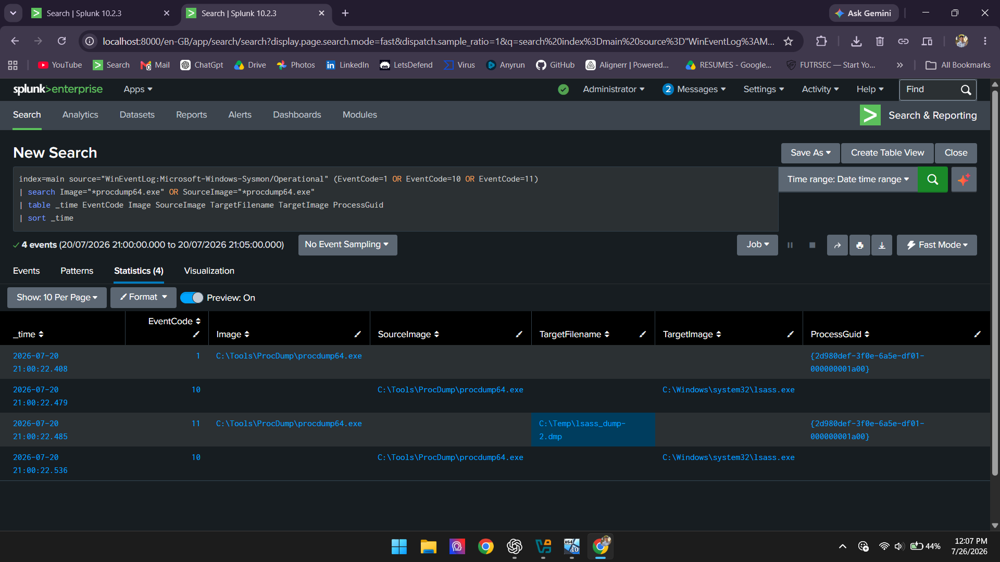
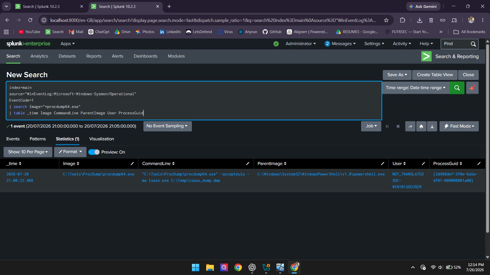
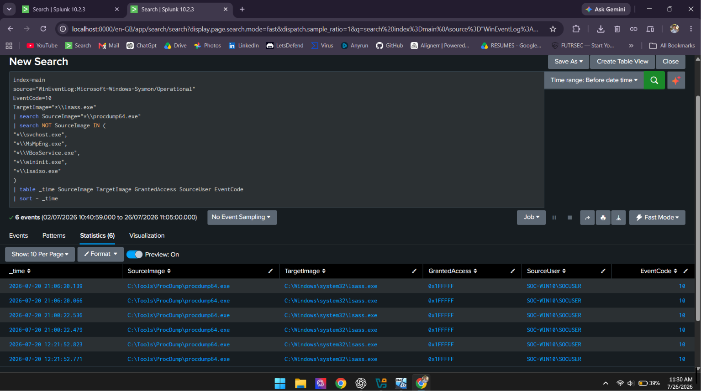
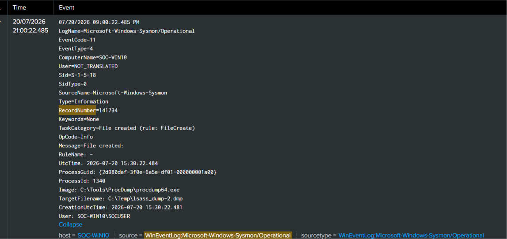

# 🔐 Credential Dumping Detection & Investigation

> **SOC Home Lab – Project 03**

This project demonstrates the detection and investigation of a **Credential Dumping attack (MITRE ATT&CK T1003 - OS Credential Dumping)** using **Splunk Enterprise**, **Sysmon**, and **Windows Event Logs**. The investigation follows a real SOC analyst workflow, including detection, alert triage, event correlation, root cause analysis, and incident documentation.


---

# 📑 Table of Contents

- [Project Objective](#project-objective)
- [Technologies Used](#technologies-used)
- [Lab Environment](#lab-environment)
- [Architecture](#architecture)
- [Attack Scenario](#attack-scenario)
- [Detection Logic](#detection-logic)
- [Investigation Summary](#investigation-summary)
- [Skills Demonstrated](#skills-demonstrated)
- [Documentation](#documentation)
- [Conclusion](#conclusion)
- [Screenshots](#screenshots)

---

# 🎯 Project Objective

The objective of this project is to detect and investigate a **Credential Dumping attack** by analyzing Sysmon telemetry in Splunk Enterprise and documenting the complete SOC investigation lifecycle.

---

# 🛠 Technologies Used

- Splunk Enterprise
- Sysmon
- Splunk Universal Forwarder
- Windows 10 Virtual Machine
- ProcDump
- Windows Event Logs

---

# 🖥️ Lab Environment

| Component | Technology |
|-----------|------------|
| Host Machine | Windows 11 |
| SIEM | Splunk Enterprise |
| Victim Machine | Windows 10 Virtual Machine |
| Endpoint Monitoring | Sysmon |
| Log Forwarding | Splunk Universal Forwarder |
| Attack Tool | ProcDump |

---

# 🏗️ Architecture

```text
                    Attacker
                     ProcDump
                        │
                        ▼
+----------------------------------------+
| Windows 10 Virtual Machine             |
|----------------------------------------|
| ProcDump Execution                     |
| Sysmon                                 |
| Windows Event Logs                     |
| Splunk Universal Forwarder             |
+-------------------+--------------------+
                    │
                    ▼
          Splunk Enterprise SIEM
                    │
      Detection • Correlation • Investigation
```

---

# ⚔️ Attack Scenario

A simulated Credential Dumping attack was performed using **ProcDump** to access the **LSASS** process. Sysmon captured process creation, process access, and dump file creation events, which were forwarded to Splunk Enterprise for detection and investigation.

---

# 🔍 Detection Logic

The attack was detected using a custom Splunk SPL query that monitored Sysmon Event IDs associated with process creation, LSASS access, and dump file creation.

## Splunk Detection Query

```spl
index=main source="WinEventLog:Microsoft-Windows-Sysmon/Operational"
(EventCode=1 OR EventCode=10 OR EventCode=11)
| search Image="*procdump64.exe" OR SourceImage="*procdump64.exe"
| table _time EventCode Image SourceImage TargetImage TargetFilename ProcessGuid
```

---

# 📝 Investigation Summary

| Event ID | Description |
|----------|-------------|
| 1 | ProcDump Process Creation |
| 10 | LSASS Process Access |
| 11 | LSASS Dump File Creation |

**Incident Status:** ✅ True Positive

---

# 💡 Skills Demonstrated

- Splunk SIEM Monitoring
- Detection Engineering
- Windows Event Log Analysis
- Sysmon Log Analysis
- Threat Hunting
- Alert Triage
- Event Correlation
- Incident Investigation
- Root Cause Analysis
- MITRE ATT&CK Mapping
- Security Documentation

---

# 📄 Documentation

Additional investigation documents:

- 📘 **[Investigation Report](Investigation.md)**
- 📙 **[Technical Documentation](Documentation.md)**

---

# ✅ Conclusion

This project demonstrates the end-to-end detection and investigation of a Credential Dumping attack using Splunk Enterprise and Sysmon. The investigation includes alert detection, event correlation, evidence collection, MITRE ATT&CK mapping, and documentation following SOC analyst methodologies.

---

# 📸 Screenshots

## 1. Detection Rule Development



---

## 2. Triggered Alerts



---

## 3. Alert Overview



---

## 4. Detection Results



---

## 5. Event Correlation



---

## 6. Event ID 1 – ProcDump Process Creation

> Sysmon Event ID 1 confirms the execution of **procdump64.exe**, marking the beginning of the credential dumping attack.



---

## 7. Event ID 10 – LSASS Process Access

> Sysmon Event ID 10 shows **procdump64.exe** requesting access to the **LSASS** process to obtain credential data.



---

## 8. Event ID 11 – Dump File Creation

> Sysmon Event ID 11 records the creation of the LSASS memory dump file, confirming successful credential dumping activity.



---

# 👨‍💻 Author

**Hemanth Kumar**

Cyber Security Graduate | SOC Analyst Enthusiast | Splunk | Sysmon | Threat Detection | Incident Response
